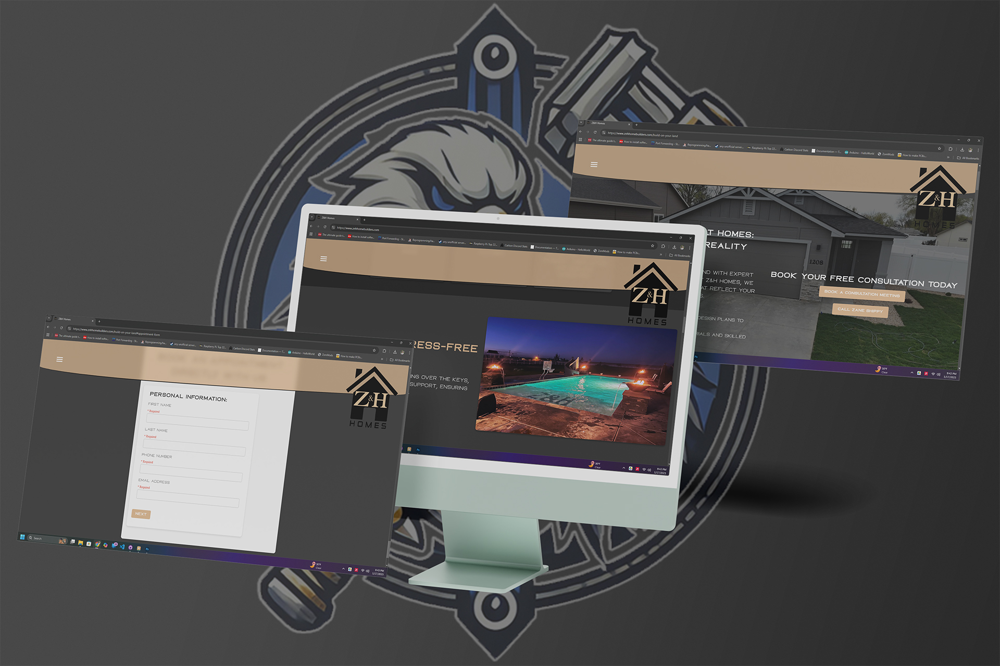

# Verso Backend



**Verso Backend** is a Flask-based backend template designed for rapid deployment on Heroku for as low as $7/month (https://www.heroku.com/). It offers a robust foundation for building scalable, secure web applications with features like user authentication, a full CMS blogging system, appointment scheduling, and database management. The template is highly extensible, integrating seamlessly with frontend frameworks or templating engines like Jinja2, Tailwind CSS, or Figma-to-Webflow pages.

## Features

- **User Authentication**: Secure registration, login, password reset, and role-based access control using Flask-Login and bcrypt.
- **CMS Blogging System**: Full-featured blogging with CKEditor for rich text editing, supporting admin and blogger roles for post creation, editing, and management.
- **Database Models**: Predefined SQLAlchemy models for users, roles, appointments, services, estimators, posts, and business configurations.
- **Forms**: WTForms with CSRF protection for secure user input handling and validation.
- **Appointment Scheduling**: AppointQix, Verso Industries’ native system, with FullCalendar integration for date and time slot selection.
- **Email Support**: Configured with Flask-Mail for password resets and notifications, with plans to adopt provider-specific APIs (e.g., SendGrid).
- **Admin Dashboard**: Comprehensive interface for managing users, roles, appointments, services, estimators, and business settings.
- **User Dashboards**: Role-based dashboards (e.g., commercial, user) replace the homepage for logged-in users.
- **Heroku Ready**: Pre-configured for easy deployment with a Procfile and environment variable setup.
- **SEO Optimization**: Sitemap generation and submission to Bing for improved search engine indexing.
- **Modular Design**: Organized with Flask Blueprints for extensibility and maintainability.
- **Image Handling**: Support for image uploads in blog posts with compression utilities and secure storage.
- **Time Zone Support**: Robust handling of company and user time zones for appointments using pytz.

## Prerequisites

- **Python 3.10.11**: Ensure this version is installed.
- **pip**: Python package installer.
- **Virtualenv**: Recommended for isolating dependencies.
- **Heroku CLI**: Required for Heroku deployment.
- **Git**: For version control and repository cloning.

## Getting Started

Welcome to Verso Backend! Depending on your goals, there are two primary ways to interact with this repository:

### For Contributors

If you wish to contribute to the development of Verso Backend, please follow these steps:

1. **Clone the Repository**
   ```bash
   git clone https://github.com/versoindustries/verso-backend.git
   cd verso-backend
   ```

2. **Proceed to Setup Instructions**
   - Follow the [Setup Instructions](#setup-instructions) to configure your local development environment.
   - Make your changes, test them, and submit a pull request as outlined in the [Contributing](#contributing) section.

### For Users

If you intend to use Verso Backend as a template for your own project, follow these steps:

1. **Create a New Repository from This Template**
   - Navigate to the [Verso Backend repository](https://github.com/versoindustries/verso-backend).
   - Click on the "Use this template" button.
   - Follow the prompts to create a new repository under your GitHub account.

2. **Clone Your New Repository**
   ```bash
   git clone https://github.com/your-username/your-new-repo.git
   cd your-new-repo
   ```

3. **Proceed to Setup Instructions**
   - Follow the [Setup Instructions](#setup-instructions) to set up your project.
   - Customize the project to fit your specific needs, such as updating the project name, database configurations, and other settings.

## Setup Instructions

After obtaining the repository (either by cloning for contributors or creating a new repository from the template for users), follow these steps to set up the project locally:

1. **Create a Virtual Environment**
   ```bash
   python -m venv env
   ```

2. **Activate the Virtual Environment**
   - On Windows:
     ```bash
     env\Scripts\activate
     ```
   - On macOS/Linux:
     ```bash
     source env/bin/activate
     ```

3. **Install Dependencies**
   ```bash
   pip install -r requirements.txt
   ```

4. **Set Environment Variables**
   - Create a `.env` file in the root directory with:
     ```
     FLASK_APP=app
     SECRET_KEY=your_secure_random_key
     DATABASE_URL=sqlite:///mydatabase.sqlite  # Or your preferred database URL
     MAIL_SERVER=smtp.example.com
     MAIL_PORT=587
     MAIL_USE_TLS=True
     MAIL_USERNAME=your_email
     MAIL_PASSWORD=your_password
     MAIL_DEFAULT_SENDER=your_email
     ```
   - Load variables (optional for local development):
     - On Windows:
       ```bash
       set FLASK_APP=app
       ```
     - On macOS/Linux:
       ```bash
       export FLASK_APP=app
       ```

5. **Initialize the Database**
   ```bash
   python dbl.py
   ```

6. **Run Database Migrations**
   ```bash
   flask db init
   flask db migrate
   flask db upgrade
   ```

7. **Create Default Roles**
   ```bash
   flask create-roles
   ```

8. **Seed Business Configuration**
   ```bash
   flask seed-business-config
   ```

9. **Run the Application**
   ```bash
   flask run --host=0.0.0.0 --debug
   ```
   - **Note**: The `--host=0.0.0.0` flag allows LAN connections for local development only. Avoid using it in production.

10. **Set Admin User**
    - After registering an account via the web app, set the user as admin:
      ```bash
      flask set-admin your_email@example.com
      ```
    - Replace `your_email@example.com` with the registered email.

## Deployment to Heroku

To deploy the application on Heroku:

1. **Install Heroku CLI and Log In**
   ```bash
   heroku login
   ```

2. **Create a Heroku App**
   ```bash
   heroku create your-app-name
   ```

3. **Set Environment Variables on Heroku**
   ```bash
   heroku config:set FLASK_APP=app
   heroku config:set SECRET_KEY=your_secret_key
   heroku config:set DATABASE_URL=your_database_url
   heroku config:set MAIL_SERVER=your_mail_server
   heroku config:set MAIL_PORT=your_mail_port
   heroku config:set MAIL_USE_TLS=True  # or False
   heroku config:set MAIL_USERNAME=your_mail_username
   heroku config:set MAIL_PASSWORD=your_mail_password
   heroku config:set MAIL_DEFAULT_SENDER=your_default_sender
   ```
   - Replace placeholders with appropriate values.

4. **Push to Heroku**
   ```bash
   git push heroku main
   ```

5. **Run Migrations on Heroku**
   ```bash
   heroku run flask db upgrade
   ```

6. **Create Default Roles on Heroku**
   ```bash
   heroku run flask create-roles
   ```

7. **Seed Business Configuration on Heroku**
   ```bash
   heroku run flask seed-business-config
   ```

Alternatively, link your Heroku account to your GitHub repository and deploy directly from GitHub.

## Usage

- Access the app at `http://localhost:5000` locally or your Heroku app URL.
- **Public Features**:
  - View the homepage with a gallery and contact form.
  - Request estimates via the appointment scheduling form.
  - Browse published blog posts.
- **Authenticated Features**:
  - Register and log in to access role-based dashboards (user, commercial, admin, blogger).
  - Bloggers can create, edit, and manage posts using CKEditor.
  - Admins can manage users, roles, services, estimators, appointments, and business settings.
- **Admin Features**:
  - Access the admin dashboard at `/admin/dashboard`.
  - Generate and submit sitemaps for SEO.
  - Delete contact form submissions and appointments.

## Notes on Database Migrations

When updating `models.py` or `forms.py`, update the database schema:

1. **Shut Down the Server**
   - Press `Ctrl + C`.
2. **Generate a Migration**
   ```bash
   flask db migrate -m "Description of changes"
   ```
3. **Apply the Migration**
   ```bash
   flask db upgrade
   ```

## Integrating with Frontend

This backend supports integration with various frontend solutions:

- **Jinja2**: Default templating engine with mobile-first, responsive design (optimized for 768px and 480px viewports).
- **Tailwind CSS**: Utility-first styling for custom CSS in `static/css`.
- **Figma to Webflow**: Design in Figma, export to Webflow, and connect to this backend.
- **Headless CMS**: Expose API endpoints (e.g., `/api/upcoming_appointments`, `/api/business_config`) for React, Vue, or other frameworks.
- **CKEditor**: Integrated for rich text editing in blog posts, with sanitized input to prevent XSS.

To integrate a custom frontend:
- Modify routes in `routes/` and templates in `templates/`.
- Extend API endpoints in `routes/main_routes.py` or create new blueprints.
- Use `url_for` for internal routes and static assets in templates.

## Coding Standards

- Adheres to PEP 8 guidelines for Python code.
- Uses Flask Blueprints for modular route organization.
- Employs Jinja2 template inheritance with `base.html` for consistent layouts.
- Implements custom error pages (e.g., 404, 403) for better UX.
- Sanitizes user inputs to prevent SQL injection and XSS (using bleach for blog content).
- Follows OWASP Top 10 security practices.
- Includes logging for debugging and error tracking.
- Uses environment variables for configuration (via `.env`).

## Notes

- **`docs.md`**: Detailed breakdown of backend structure and components (to be created or updated).
- **Grok3 Documentation**: Located in the `docs` folder, explaining backend extension with xAI’s Grok3 (https://grok.com/).
  - **WARNING**: Docs and system instructions are tailored for xAI Grok3. Compatibility with other LLMs is untested.
- **License**: Apache License 2.0 (see [LICENSE](LICENSE)).
- **Static Assets**: JavaScript files in `static/js` are minimized for performance; images are optimized via `modules/utils.py`.

## Still In The Works

- **Email Enhancements**: Transition from Flask-Mail to provider-specific APIs (e.g., SendGrid, Mailgun) for robust email delivery.
- **Testing**: Expand unit tests using pytest for broader coverage.
- **Windows Executable**: Develop a tool to automate repository cloning, environment setup, and role creation for developers.

## Future Plans

Led by founder Michael B. Zimmerman, Verso Backend aims to become a community-supported, Python-based CMS for businesses. Key goals include:
- Enhancing the blogging CMS with advanced features (e.g., tags, comments).
- Improving API endpoints for headless CMS use cases.
- Creating a Windows executable to streamline development setup, automating environment creation, role setup, and migrations.
- Sharing a detailed roadmap to align community contributions.

This template already provides a cost-effective, fast website solution, deployable on Heroku for $7/month, with a scalable architecture for small to medium businesses.

## Contributing

Contributions are welcome! To contribute:

1. Fork the repository.
2. Create a feature or bugfix branch (`git checkout -b feature/your-feature`).
3. Commit changes with descriptive messages (`git commit -m "Add feature X"`).
4. Push to your branch (`git push origin feature/your-feature`).
5. Submit a pull request with a clear description.

Ensure code adheres to PEP 8, includes docstrings, and passes existing tests. Follow the project’s style guide in [System Instructions](#).

## Support the Project

- **Contribute**: Submit pull requests or report issues on GitHub Issues.
- **Sponsor**: Support development via GitHub Sponsors or Stripe (see sponsorship tiers below).
- **Share**: Promote Verso Backend on social media, forums, or X (@bigmikez99z) to increase visibility.

## Sponsorship Tiers for Verso Backend

Support **Verso Backend**, a Flask-based open-source CMS backend with secure authentication, appointment booking, and AI-driven extensibility via Grok3. Your sponsorship fuels innovation and community growth. Choose a tier via GitHub Sponsors or Stripe.

### Community Supporter
- **Monthly Amount**: $5
- **Benefits**:
  - Name listed on GitHub Sponsors page and README.md.
  - Access to supporters-only Discord channel.
- **Description**: Ideal for open-source enthusiasts.
- **Sponsor Link**: [Sponsor Now](https://buy.stripe.com/fZu14nfiYgTYelU6Cygfu0J)

### Developer Advocate
- **Monthly Amount**: $15
- **Benefits**:
  - All Community Supporter benefits.
  - Early access to updates and beta features via email or private repository.
- **Description**: For developers tracking Verso Backend’s progress.
- **Sponsor Link**: [Sponsor Now](https://buy.stripe.com/cNi9AT6Ms8nsb9I7GCgfu0K)

### Project Patron
- **Monthly Amount**: $50
- **Benefits**:
  - All Developer Advocate benefits.
  - Personal thank-you via email or X post from @bigmikez99z.
  - Acknowledgment in documentation or blog posts.
- **Description**: For supporters making a significant impact.
- **Sponsor Link**: [Sponsor Now](https://buy.stripe.com/14A3cv0o49rwb9I1iegfu0L)

### Corporate Sponsor
- **Monthly Amount**: $6,000
- **Benefits**:
  - All Project Patron benefits.
  - Company logo on GitHub README and future website.
  - Priority queue for feature requests or bug fixes.
- **Description**: For businesses using Verso Backend in production.
- **Sponsor Link**: [Sponsor Now](https://buy.stripe.com/3cIaEX4Ek9rw6Ts6Cygfu0M)

### Strategic Partner
- **Annual Amount**: $150,000
- **Benefits**:
  - All Corporate Sponsor benefits.
  - Quarterly virtual meetings with maintainers.
  - Propose features or integrations (e.g., API endpoints).
  - Early access to new modules or AI features.
- **Description**: For organizations shaping Verso Backend’s roadmap.
- **Sponsor Link**: [Sponsor Now](https://buy.stripe.com/6oUcN51s88nsdhQ5yugfu0N)

### Premier Sponsor
- **Annual Amount**: $300,000
- **Benefits**:
  - All Strategic Partner benefits.
  - Co-branding opportunities (e.g., “Verso Backend, Powered by [Sponsor]”).
  - Dedicated development sprint for one feature per year.
  - Dedicated support channel for technical queries.
  - Naming rights for a module or feature.
- **Description**: For enterprise stakeholders integrating Verso Backend.
- **Sponsor Link**: [Sponsor Now](https://buy.stripe.com/fZu4gz6Ms1Z45Po1iegfu0O)

---

## Why Sponsor Verso Backend?
- **Innovative Technology**: Support a Flask-based CMS with Grok3 integration for AI-driven development.
- **Business Value**: Heroku-ready backend reduces development costs for web applications.
- **Community Impact**: Build a community-driven project and gain visibility.
- **Influence**: Higher tiers offer roadmap input and feature prioritization.

---

## Contributors

- **Michael Zimmerman**: Founder and CEO of Verso Industries, creator of HighNoon LLM and HSMN architecture, Lead Developer.
- **Jacob Godina**: President and Co-Founder of Verso Industries, contributor to code, design, and marketing.

## Contact

- **Email**: `zimmermanmb99@gmail.com`
- **X**: @bigmikez99z
- **Website**: `www.versoindustries.com` (coming soon)

## Discord Server

Join our community: [https://discord.gg/pBrSPbaMnM](https://discord.gg/pBrSPbaMnM)

## License

Licensed under the [Apache License 2.0](LICENSE).