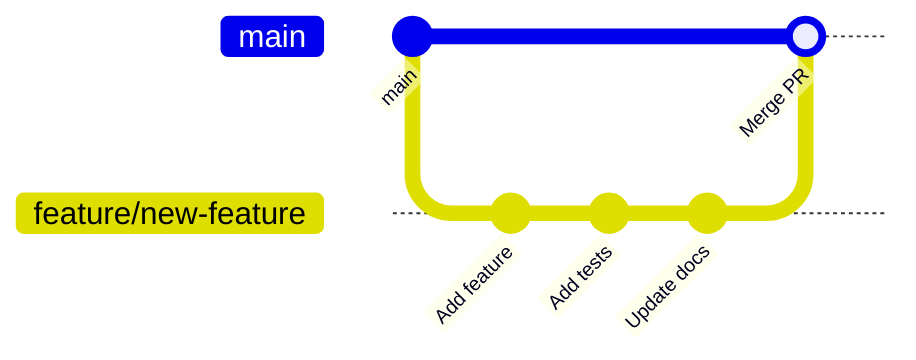

# Contributing to Verso-Backend

Thank you for your interest in contributing to Verso-Backend! This document provides guidelines and instructions for contributing to the project.

## Table of Contents

- [Code of Conduct](#code-of-conduct)
- [Getting Started](#getting-started)
- [Development Workflow](#development-workflow)
- [Code Style](#code-style)
- [Commit Messages](#commit-messages)
- [Pull Request Process](#pull-request-process)
- [Testing Guidelines](#testing-guidelines)
- [Documentation](#documentation)

## Code of Conduct

By participating in this project, you agree to maintain a respectful and inclusive environment. We expect all contributors to:

- Be respectful and considerate in all interactions
- Welcome newcomers and help them get started
- Focus on constructive feedback
- Accept responsibility for mistakes and learn from them

## Getting Started

### Prerequisites

- Python 3.10+
- Node.js 18+ (for frontend assets)
- PostgreSQL (or SQLite for development)
- Git

### Local Setup

1. **Fork and Clone**
   ```bash
   git clone https://github.com/YOUR_USERNAME/verso-backend.git
   cd verso-backend
   ```

2. **Create Virtual Environment**
   ```bash
   python3 -m venv .venv
   source .venv/bin/activate  # Linux/macOS
   # or
   .venv\Scripts\activate  # Windows
   ```

3. **Install Dependencies**
   ```bash
   pip install -r requirements.txt
   pip install -r requirements-dev.txt  # Development dependencies
   npm install  # Frontend dependencies
   ```

4. **Configure Environment**
   ```bash
   cp .env.example .env
   # Edit .env with your configuration
   ```

5. **Initialize Database**
   ```bash
   flask db upgrade
   flask create-roles
   flask seed-business-config
   ```

6. **Run Development Server**
   ```bash
   flask run --debug
   ```

## Development Workflow

### Branch Naming Convention

Use descriptive branch names with the following prefixes:

| Prefix | Purpose | Example |
|--------|---------|---------|
| `feature/` | New features | `feature/gift-card-system` |
| `fix/` | Bug fixes | `fix/cart-calculation-error` |
| `docs/` | Documentation | `docs/api-reference-update` |
| `refactor/` | Code refactoring | `refactor/order-processing` |
| `test/` | Test additions | `test/auth-integration-tests` |
| `chore/` | Maintenance tasks | `chore/update-dependencies` |

### Development Flow



1. Create a branch from `main`
2. Make your changes
3. Write/update tests
4. Update documentation
5. Submit a pull request

## Code Style

### Python Style Guide

We follow PEP 8 with some modifications:

- **Line length**: 100 characters maximum
- **Imports**: Use `isort` for sorting
- **Formatting**: Use `black` for formatting
- **Docstrings**: Google style docstrings

```python
def calculate_cart_total(items: list[CartItem], discount: Discount | None = None) -> int:
    """Calculate the total price of cart items with optional discount.
    
    Args:
        items: List of cart items to calculate.
        discount: Optional discount to apply.
        
    Returns:
        Total price in cents.
        
    Raises:
        ValueError: If items list is empty.
    """
    if not items:
        raise ValueError("Cart cannot be empty")
    
    subtotal = sum(item.price * item.quantity for item in items)
    
    if discount:
        subtotal = apply_discount(subtotal, discount)
    
    return subtotal
```

### Flask Route Conventions

```python
@blueprint.route('/items/<int:item_id>', methods=['GET', 'POST'])
@login_required
@require_role('admin')
def edit_item(item_id: int):
    """Edit an existing item.
    
    GET: Display edit form
    POST: Process form submission
    """
    item = Item.query.get_or_404(item_id)
    form = ItemForm(obj=item)
    
    if form.validate_on_submit():
        form.populate_obj(item)
        db.session.commit()
        flash('Item updated successfully.', 'success')
        return redirect(url_for('.view_item', item_id=item_id))
    
    return render_template('items/edit.html', form=form, item=item)
```

### Template Conventions

```html

Page Title - {{ super() }}


<main class="container" role="main">
    <h1>{{ page_title }}</h1>
    
    
        <ul class="item-list">
            
                <li class="item-list__item">
                    {{ item.name }}
                </li>
            
        </ul>
    
        <p class="empty-state">No items found.</p>
    
</main>

```

### JavaScript/TypeScript

- Use TypeScript for all React components
- Use ESLint and Prettier for formatting
- Prefer functional components with hooks

```typescript
import React, { useState, useEffect } from 'react';

interface Props {
    initialCount: number;
    onCountChange?: (count: number) => void;
}

export const Counter: React.FC<Props> = ({ initialCount, onCountChange }) => {
    const [count, setCount] = useState(initialCount);
    
    useEffect(() => {
        onCountChange?.(count);
    }, [count, onCountChange]);
    
    return (
        <button onClick={() => setCount(c => c + 1)}>
            Count: {count}
        </button>
    );
};
```

### CSS Conventions

- Use BEM naming convention
- Prefer CSS custom properties for theming
- Mobile-first responsive design

```css
/* Component: .card */
.card {
    --card-padding: var(--spacing-md, 1rem);
    --card-radius: var(--radius-lg, 0.5rem);
    
    padding: var(--card-padding);
    border-radius: var(--card-radius);
    background: var(--color-surface);
}

.card__header {
    margin-bottom: var(--spacing-sm);
}

.card__title {
    font-size: var(--font-size-lg);
    font-weight: 600;
}

.card--highlighted {
    border: 2px solid var(--color-primary);
}

@media (min-width: 768px) {
    .card {
        --card-padding: var(--spacing-lg, 1.5rem);
    }
}
```

## Commit Messages

Follow the [Conventional Commits](https://www.conventionalcommits.org/) specification:

```
<type>[optional scope]: <description>

[optional body]

[optional footer(s)]
```

### Types

| Type | Description |
|------|-------------|
| `feat` | New feature |
| `fix` | Bug fix |
| `docs` | Documentation changes |
| `style` | Code style changes (formatting, semicolons) |
| `refactor` | Code refactoring |
| `test` | Adding or updating tests |
| `chore` | Maintenance tasks |
| `perf` | Performance improvements |
| `ci` | CI/CD changes |

### Examples

```
feat(ecommerce): add gift card redemption at checkout

- Implement GiftCard model with balance tracking
- Add gift card input to cart page
- Create admin interface for issuing gift cards

Closes #123
```

```
fix(calendar): correct timezone handling for appointments

Appointments were being saved in local time instead of UTC,
causing incorrect display for users in different timezones.

Fixes #456
```

## Pull Request Process

### Before Submitting

- [ ] Code follows the style guidelines
- [ ] All tests pass locally (`pytest`)
- [ ] New features include tests
- [ ] Documentation is updated
- [ ] Commit messages follow conventions
- [ ] Branch is up to date with `main`

### PR Template

```markdown
## Description
Brief description of changes

## Type of Change
- [ ] Bug fix
- [ ] New feature
- [ ] Breaking change
- [ ] Documentation update

## Testing
- Describe testing performed
- Include test commands if applicable

## Screenshots (if applicable)
Add screenshots for UI changes

## Checklist
- [ ] Tests added/updated
- [ ] Documentation updated
- [ ] No breaking changes (or documented)
```

### Review Process

1. **Automated Checks**: CI must pass (lint, test, build)
2. **Code Review**: At least one maintainer approval
3. **Documentation Review**: For significant changes
4. **Merge**: Squash and merge to `main`

## Testing Guidelines

### Test Structure

```
tests/
├── conftest.py           # Shared fixtures
├── test_models.py        # Model unit tests
├── test_auth.py          # Authentication tests
├── test_admin.py         # Admin route tests
├── test_api.py           # API endpoint tests
├── integration/          # Integration tests
│   └── test_checkout.py
└── e2e/                  # End-to-end tests
    └── test_user_flow.py
```

### Writing Tests

```python
import pytest
from app.models import User, Order

class TestOrderModel:
    """Tests for the Order model."""
    
    def test_order_creation(self, db_session):
        """Test creating a new order."""
        order = Order(
            user_id=1,
            status='pending',
            total_cents=1000
        )
        db_session.add(order)
        db_session.commit()
        
        assert order.id is not None
        assert order.order_number is not None
    
    def test_order_total_calculation(self, sample_order):
        """Test order total includes all components."""
        assert sample_order.total_cents == (
            sample_order.subtotal_cents +
            sample_order.tax_cents +
            sample_order.shipping_cents -
            sample_order.discount_cents
        )
    
    @pytest.mark.parametrize("status,expected", [
        ("pending", False),
        ("paid", True),
        ("shipped", True),
        ("cancelled", False),
    ])
    def test_order_is_paid(self, sample_order, status, expected):
        """Test is_paid property for various statuses."""
        sample_order.status = status
        assert sample_order.is_paid == expected
```

### Running Tests

```bash
# Run all tests
pytest

# Run with coverage
pytest --cov=app --cov-report=html

# Run specific test file
pytest tests/test_auth.py

# Run specific test
pytest tests/test_auth.py::TestLogin::test_valid_login

# Run with verbose output
pytest -v

# Run only marked tests
pytest -m "not slow"
```

## Documentation

### When to Update Docs

- Adding new features
- Changing API endpoints
- Modifying configuration
- Updating dependencies
- Changing database schema

### Documentation Locations

| Type | Location |
|------|----------|
| Architecture | `docs/architecture.md` |
| API Reference | `docs/api_reference.md` |
| Database Schema | `docs/database_schema.md` |
| Deployment | `docs/deployment.md` |
| User Guides | `docs/user/` |
| Inline Docs | Docstrings in code |

### Docstring Example

```python
class OrderService:
    """Service class for order operations.
    
    This service handles order creation, payment processing,
    and fulfillment workflows.
    
    Attributes:
        db: Database session
        stripe: Stripe client instance
        
    Example:
        >>> service = OrderService(db, stripe)
        >>> order = service.create_order(cart, user)
        >>> service.process_payment(order, payment_method)
    """
    
    def create_order(
        self,
        cart: Cart,
        user: User | None = None,
        shipping_address: dict | None = None
    ) -> Order:
        """Create a new order from a shopping cart.
        
        Args:
            cart: The shopping cart to convert to an order.
            user: Optional user account for the order.
            shipping_address: Shipping address dictionary.
            
        Returns:
            The newly created Order instance.
            
        Raises:
            InsufficientInventoryError: If any item is out of stock.
            InvalidCartError: If cart is empty or invalid.
        """
        ...
```

## Getting Help

- **Questions**: Open a GitHub Discussion
- **Bugs**: Open a GitHub Issue
- **Security**: Email security@versoindustries.com

---

Thank you for contributing to Verso-Backend! Your efforts help make sovereign business software accessible to everyone.
