# Database Schema Documentation

This document provides a comprehensive overview of the Verso-Backend database schema, including all models, relationships, and indexes.

## Schema Overview

Verso uses SQLAlchemy ORM with support for both SQLite (development) and PostgreSQL (production). The schema contains **80+ models** organized into functional domains.

## Entity Relationship Diagram

```mermaid
erDiagram
    %% Core Identity
    User ||--o{ Order : places
    User ||--o{ Appointment : books
    User ||--o{ Post : authors
    User ||--o{ Lead : manages
    User ||--o{ Message : sends
    User ||--o{ FormSubmission : submits
    User ||--o{ Wishlist : has
    User }|--|{ Role : has
    User ||--o| TOTPDevice : has
    User ||--o{ BackupCode : has
    User ||--o{ LoginAttempt : generates
    
    %% E-commerce
    Product ||--o{ ProductVariant : has
    Product ||--o{ ProductImage : has
    Product ||--o{ OrderItem : included_in
    Product }o--|| Category : belongs_to
    Product ||--o{ Wishlist : in
    Product ||--o{ Review : has
    
    ProductVariant ||--o{ OrderItem : included_in
    
    Order ||--|{ OrderItem : contains
    Order }o--o| Discount : applies
    Order }o--o| GiftCard : uses
    Order }o--|| User : placed_by
    
    Collection ||--o{ CollectionProduct : contains
    Collection ||--o{ CollectionRule : has
    
    ProductBundle ||--|{ BundleItem : contains
    BundleItem }o--|| Product : references
    
    GiftCard ||--o{ GiftCardTransaction : has
    
    %% Scheduling
    Appointment }o--|| Estimator : assigned_to
    Appointment }o--|| Service : for
    Appointment }o--o| AppointmentType : type
    Appointment }o--o| ResourceBooking : has
    
    Estimator ||--o{ Availability : has
    Estimator }o--|| User : linked_to
    
    AppointmentType ||--o{ Waitlist : has
    AppointmentType }o--o| BookingPolicy : has
    
    Resource ||--o{ ResourceBooking : booked_by
    
    %% Content
    Post }o--|| Category : in
    Post ||--o{ Comment : has
    Post ||--o{ PostRevision : versions
    Post }o--|| User : authored_by
    
    Page ||--o{ PageRevision : versions
    Page ||--o{ CustomField : has
    
    %% Communication
    Channel ||--o{ Message : contains
    Channel ||--o{ ChannelMember : has
    Message }o--|| User : sent_by
    
    EmailCampaign ||--|{ EmailSend : sends
    EmailCampaign }o--|| EmailTemplate : uses
    EmailCampaign }o--|| Audience : targets
    
    DripSequence ||--o{ DripStep : has
    
    %% Forms
    FormDefinition ||--o{ FormSubmission : receives
    FormDefinition ||--o{ FormIntegration : has
    
    Survey ||--o{ SurveyResponse : receives
    
    %% Analytics
    VisitorSession ||--o{ PageView : contains
    ConversionGoal ||--o{ Conversion : tracks
    Funnel ||--|{ FunnelStep : has
```



## Model Reference

### Identity & Authentication

#### User
Primary user account model with authentication and profile data.

| Column | Type | Constraints | Description |
|--------|------|-------------|-------------|
| `id` | Integer | PK | Primary key |
| `username` | String(80) | Unique, Not Null | Login username |
| `email` | String(120) | Unique, Not Null | Email address |
| `password_hash` | String(128) | Not Null | Bcrypt password hash |
| `first_name` | String(50) | Nullable | First name |
| `last_name` | String(50) | Nullable | Last name |
| `phone` | String(20) | Nullable | Phone number |
| `avatar_url` | String(255) | Nullable | Profile image URL |
| `is_active` | Boolean | Default True | Account active status |
| `email_verified` | Boolean | Default False | Email verification status |
| `mfa_enabled` | Boolean | Default False | MFA enabled flag |
| `created_at` | DateTime | Default Now | Account creation time |
| `last_login` | DateTime | Nullable | Last login timestamp |
| `timezone` | String(50) | Default UTC | User timezone |
| `locale` | String(10) | Default en | Preferred locale |

**Relationships:**
- `roles` → Many-to-Many with `Role`
- `orders` → One-to-Many with `Order`
- `posts` → One-to-Many with `Post`
- `totp_device` → One-to-One with `TOTPDevice`
- `backup_codes` → One-to-Many with `BackupCode`

**Indexes:**
- `idx_user_email` on `email`
- `idx_user_username` on `username`

---

#### Role
User roles for RBAC authorization.

| Column | Type | Constraints | Description |
|--------|------|-------------|-------------|
| `id` | Integer | PK | Primary key |
| `name` | String(50) | Unique, Not Null | Role name |

**Default Roles:** `admin`, `user`, `commercial`, `blogger`, `employee`

---

#### TOTPDevice
TOTP-based MFA device registration.

| Column | Type | Constraints | Description |
|--------|------|-------------|-------------|
| `id` | Integer | PK | Primary key |
| `user_id` | Integer | FK → User | Associated user |
| `secret` | String(32) | Not Null | TOTP secret (encrypted) |
| `name` | String(100) | Default "Primary" | Device name |
| `is_confirmed` | Boolean | Default False | Confirmation status |
| `created_at` | DateTime | Default Now | Registration time |

---

#### BackupCode
One-time use backup codes for MFA recovery.

| Column | Type | Constraints | Description |
|--------|------|-------------|-------------|
| `id` | Integer | PK | Primary key |
| `user_id` | Integer | FK → User | Associated user |
| `code_hash` | String(128) | Not Null | Bcrypt hash of code |
| `used_at` | DateTime | Nullable | Usage timestamp |

---

### E-commerce

#### Product
Shop products with variant support.

| Column | Type | Constraints | Description |
|--------|------|-------------|-------------|
| `id` | Integer | PK | Primary key |
| `name` | String(200) | Not Null | Product name |
| `slug` | String(200) | Unique | URL slug |
| `description` | Text | Nullable | Product description |
| `price` | Integer | Not Null | Price in cents |
| `compare_at_price` | Integer | Nullable | Original price for sales |
| `cost_price` | Integer | Nullable | Cost for margin calculation |
| `sku` | String(50) | Unique | Stock keeping unit |
| `inventory_count` | Integer | Default 0 | Stock quantity |
| `is_digital` | Boolean | Default False | Digital product flag |
| `is_active` | Boolean | Default True | Published status |
| `weight_grams` | Integer | Nullable | Product weight |
| `category_id` | Integer | FK → Category | Product category |
| `seo_title` | String(70) | Nullable | SEO title override |
| `seo_description` | String(160) | Nullable | SEO description |
| `created_at` | DateTime | Default Now | Creation timestamp |
| `updated_at` | DateTime | On Update | Last update time |

**Relationships:**
- `variants` → One-to-Many with `ProductVariant`
- `images` → One-to-Many with `ProductImage`
- `category` → Many-to-One with `Category`
- `reviews` → One-to-Many with `Review`

**Indexes:**
- `idx_product_slug` on `slug`
- `idx_product_category` on `category_id`
- `idx_product_active` on `is_active`

---

#### ProductVariant
Product variations (size, color, etc.).

| Column | Type | Constraints | Description |
|--------|------|-------------|-------------|
| `id` | Integer | PK | Primary key |
| `product_id` | Integer | FK → Product | Parent product |
| `sku` | String(50) | Unique | Variant SKU |
| `name` | String(100) | Not Null | Variant name |
| `price_adjustment` | Integer | Default 0 | Price delta in cents |
| `inventory_count` | Integer | Default 0 | Variant stock |
| `attributes` | JSON | Nullable | Attribute key-value pairs |
| `is_active` | Boolean | Default True | Availability status |

---

#### Order
Customer orders with multi-item support.

| Column | Type | Constraints | Description |
|--------|------|-------------|-------------|
| `id` | Integer | PK | Primary key |
| `order_number` | String(20) | Unique | Human-readable order ID |
| `user_id` | Integer | FK → User | Customer (nullable for guest) |
| `status` | String(20) | Default pending | Order status |
| `subtotal_cents` | Integer | Not Null | Pre-discount total |
| `discount_cents` | Integer | Default 0 | Discount amount |
| `tax_cents` | Integer | Default 0 | Tax amount |
| `shipping_cents` | Integer | Default 0 | Shipping cost |
| `total_cents` | Integer | Not Null | Final total |
| `currency` | String(3) | Default USD | Currency code |
| `shipping_address` | JSON | Nullable | Shipping address |
| `billing_address` | JSON | Nullable | Billing address |
| `stripe_session_id` | String(255) | Nullable | Stripe checkout ID |
| `stripe_payment_intent` | String(255) | Nullable | Payment intent ID |
| `discount_id` | Integer | FK → Discount | Applied discount |
| `gift_card_id` | Integer | FK → GiftCard | Applied gift card |
| `notes` | Text | Nullable | Order notes |
| `created_at` | DateTime | Default Now | Order creation |
| `paid_at` | DateTime | Nullable | Payment timestamp |
| `shipped_at` | DateTime | Nullable | Shipment timestamp |

**Order Statuses:** `pending`, `paid`, `processing`, `shipped`, `delivered`, `cancelled`, `refunded`

**Indexes:**
- `idx_order_number` on `order_number`
- `idx_order_user` on `user_id`
- `idx_order_status` on `status`
- `idx_order_created` on `created_at`

---

#### Discount
Promotional codes and automatic discounts.

| Column | Type | Constraints | Description |
|--------|------|-------------|-------------|
| `id` | Integer | PK | Primary key |
| `code` | String(50) | Unique | Discount code |
| `name` | String(100) | Not Null | Internal name |
| `discount_type` | String(20) | Not Null | percentage, fixed_amount, free_shipping |
| `value` | Decimal(10,2) | Not Null | Discount value |
| `minimum_order_cents` | Integer | Nullable | Minimum order for eligibility |
| `maximum_discount_cents` | Integer | Nullable | Cap on discount |
| `maximum_uses` | Integer | Nullable | Total usage limit |
| `used_count` | Integer | Default 0 | Current usage count |
| `starts_at` | DateTime | Nullable | Start date |
| `ends_at` | DateTime | Nullable | End date |
| `is_active` | Boolean | Default True | Active status |

---

#### GiftCard
Store credit and gift cards.

| Column | Type | Constraints | Description |
|--------|------|-------------|-------------|
| `id` | Integer | PK | Primary key |
| `code` | String(20) | Unique | Gift card code |
| `initial_balance_cents` | Integer | Not Null | Original balance |
| `current_balance_cents` | Integer | Not Null | Current balance |
| `currency` | String(3) | Default USD | Currency |
| `expires_at` | DateTime | Nullable | Expiration date |
| `is_active` | Boolean | Default True | Active status |
| `recipient_email` | String(120) | Nullable | Recipient email |
| `recipient_name` | String(100) | Nullable | Recipient name |
| `sender_name` | String(100) | Nullable | Sender name |
| `message` | Text | Nullable | Gift message |
| `created_by_id` | Integer | FK → User | Issuing admin |
| `created_at` | DateTime | Default Now | Issue date |

---

### Scheduling

#### Appointment
Customer appointments with estimators.

| Column | Type | Constraints | Description |
|--------|------|-------------|-------------|
| `id` | Integer | PK | Primary key |
| `first_name` | String(100) | Not Null | Customer first name |
| `last_name` | String(100) | Not Null | Customer last name |
| `email` | String(120) | Not Null | Customer email |
| `phone` | String(20) | Nullable | Customer phone |
| `scheduled_time` | DateTime | Not Null | Appointment time (UTC) |
| `duration_minutes` | Integer | Default 60 | Duration |
| `status` | String(20) | Default scheduled | Status |
| `notes` | Text | Nullable | Appointment notes |
| `estimator_id` | Integer | FK → Estimator | Assigned staff |
| `service_id` | Integer | FK → Service | Service type |
| `appointment_type_id` | Integer | FK → AppointmentType | Appointment type |
| `user_id` | Integer | FK → User | Linked user account |
| `location_id` | Integer | FK → Location | Location |
| `created_at` | DateTime | Default Now | Booking time |
| `cancelled_at` | DateTime | Nullable | Cancellation time |
| `cancel_reason` | String(255) | Nullable | Cancellation reason |

**Statuses:** `scheduled`, `confirmed`, `in_progress`, `completed`, `cancelled`, `no_show`

**Indexes:**
- `idx_appointment_time` on `scheduled_time`
- `idx_appointment_estimator` on `estimator_id`
- `idx_appointment_status` on `status`

---

#### Availability
Weekly recurring availability slots.

| Column | Type | Constraints | Description |
|--------|------|-------------|-------------|
| `id` | Integer | PK | Primary key |
| `estimator_id` | Integer | FK → Estimator | Staff member |
| `day_of_week` | Integer | Not Null | 0=Monday, 6=Sunday |
| `start_time` | Time | Not Null | Start time |
| `end_time` | Time | Not Null | End time |
| `is_active` | Boolean | Default True | Active status |

---

### Content Management

#### Post
Blog posts and articles.

| Column | Type | Constraints | Description |
|--------|------|-------------|-------------|
| `id` | Integer | PK | Primary key |
| `title` | String(200) | Not Null | Post title |
| `slug` | String(200) | Unique | URL slug |
| `content` | Text | Not Null | HTML content |
| `excerpt` | Text | Nullable | Short description |
| `featured_image` | String(255) | Nullable | Featured image URL |
| `status` | String(20) | Default draft | Publication status |
| `author_id` | Integer | FK → User | Author |
| `category_id` | Integer | FK → Category | Category |
| `seo_title` | String(70) | Nullable | SEO title |
| `seo_description` | String(160) | Nullable | SEO description |
| `published_at` | DateTime | Nullable | Publication date |
| `created_at` | DateTime | Default Now | Creation date |
| `updated_at` | DateTime | On Update | Last update |
| `view_count` | Integer | Default 0 | View counter |

**Statuses:** `draft`, `pending_review`, `published`, `archived`

**Indexes:**
- `idx_post_slug` on `slug`
- `idx_post_status` on `status`
- `idx_post_published` on `published_at`

---

### Communication

#### Channel
Messaging channels for internal communication.

| Column | Type | Constraints | Description |
|--------|------|-------------|-------------|
| `id` | Integer | PK | Primary key |
| `name` | String(100) | Not Null | Channel name |
| `slug` | String(100) | Unique | URL identifier |
| `description` | Text | Nullable | Channel description |
| `channel_type` | String(20) | Default public | public, private, direct |
| `created_by_id` | Integer | FK → User | Creator |
| `is_archived` | Boolean | Default False | Archive status |
| `created_at` | DateTime | Default Now | Creation time |

---

#### Message
Individual messages in channels.

| Column | Type | Constraints | Description |
|--------|------|-------------|-------------|
| `id` | Integer | PK | Primary key |
| `channel_id` | Integer | FK → Channel | Parent channel |
| `user_id` | Integer | FK → User | Sender |
| `content` | Text | Not Null | Message content |
| `message_type` | String(20) | Default text | text, file, system |
| `attachment_url` | String(255) | Nullable | File attachment |
| `parent_id` | Integer | FK → Message | Thread parent |
| `is_edited` | Boolean | Default False | Edit flag |
| `created_at` | DateTime | Default Now | Send time |
| `edited_at` | DateTime | Nullable | Edit time |

---

### Analytics

#### PageView
Individual page view events.

| Column | Type | Constraints | Description |
|--------|------|-------------|-------------|
| `id` | Integer | PK | Primary key |
| `session_id` | String(64) | Not Null | Visitor session |
| `user_id` | Integer | FK → User | Logged-in user (nullable) |
| `path` | String(500) | Not Null | Page path |
| `referrer` | String(500) | Nullable | Referrer URL |
| `user_agent` | String(500) | Nullable | Browser user agent |
| `ip_hash` | String(64) | Nullable | Anonymized IP |
| `timestamp` | DateTime | Default Now | View time |
| `load_time_ms` | Integer | Nullable | Page load time |
| `utm_source` | String(100) | Nullable | UTM source |
| `utm_medium` | String(100) | Nullable | UTM medium |
| `utm_campaign` | String(100) | Nullable | UTM campaign |

**Indexes:**
- `idx_pageview_session` on `session_id`
- `idx_pageview_time` on `timestamp`
- `idx_pageview_path` on `path`

---

#### VisitorSession
Aggregated visitor sessions.

| Column | Type | Constraints | Description |
|--------|------|-------------|-------------|
| `id` | Integer | PK | Primary key |
| `session_token` | String(64) | Unique | Session identifier |
| `user_id` | Integer | FK → User | Logged-in user (nullable) |
| `ip_hash` | String(64) | Nullable | Anonymized IP |
| `entry_page` | String(500) | Nullable | Landing page |
| `exit_page` | String(500) | Nullable | Exit page |
| `duration_seconds` | Integer | Nullable | Session duration |
| `pages_viewed` | Integer | Default 0 | Page count |
| `bounce` | Boolean | Default True | Single page visit |
| `device_type` | String(20) | Nullable | desktop, mobile, tablet |
| `browser` | String(50) | Nullable | Browser name |
| `os` | String(50) | Nullable | Operating system |
| `country` | String(2) | Nullable | Country code |
| `started_at` | DateTime | Default Now | Session start |
| `ended_at` | DateTime | Nullable | Session end |

---

## Index Summary

### Performance Indexes

| Table | Index | Columns | Purpose |
|-------|-------|---------|---------|
| `user` | `idx_user_email` | `email` | Login lookup |
| `order` | `idx_order_status_created` | `status, created_at` | Order filtering |
| `product` | `idx_product_category_active` | `category_id, is_active` | Catalog browsing |
| `appointment` | `idx_appointment_estimator_time` | `estimator_id, scheduled_time` | Calendar queries |
| `pageview` | `idx_pageview_time_path` | `timestamp, path` | Analytics queries |

### Foreign Key Indexes

All foreign keys have corresponding indexes for join performance.

## Migrations

Migrations are managed via Flask-Migrate (Alembic):

```bash
# Create a new migration
flask db migrate -m "Description of changes"

# Apply migrations
flask db upgrade

# Rollback last migration
flask db downgrade

# View migration history
flask db history
```

## Data Types

### Custom Enums

```python
class OrderStatus(enum.Enum):
    PENDING = 'pending'
    PAID = 'paid'
    PROCESSING = 'processing'
    SHIPPED = 'shipped'
    DELIVERED = 'delivered'
    CANCELLED = 'cancelled'
    REFUNDED = 'refunded'

class PostStatus(enum.Enum):
    DRAFT = 'draft'
    PENDING_REVIEW = 'pending_review'
    PUBLISHED = 'published'
    ARCHIVED = 'archived'
```

### JSON Columns

Several models use JSON columns for flexible data:

| Model | Column | Content |
|-------|--------|---------|
| `ProductVariant` | `attributes` | `{"size": "XL", "color": "Blue"}` |
| `Order` | `shipping_address` | Address object |
| `FormSubmission` | `data` | Form field responses |
| `CollectionRule` | `conditions` | Smart collection rules |

---

*Last Updated: December 2024*
